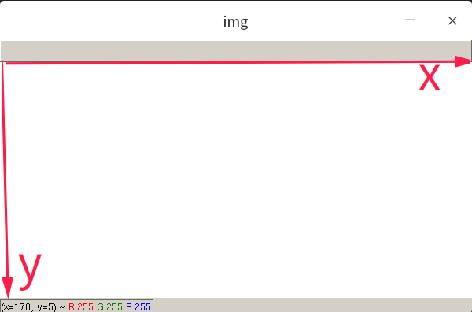
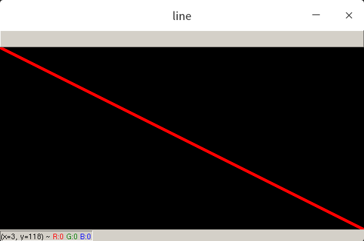
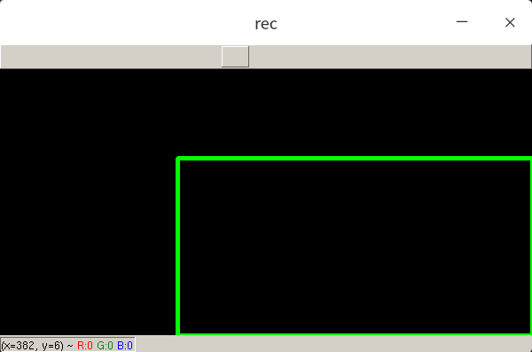
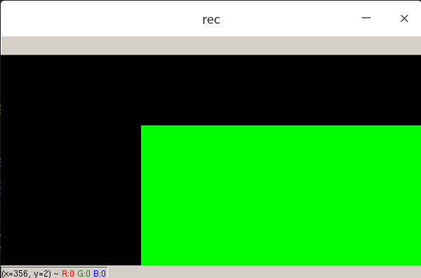
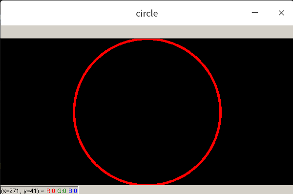

# cv2

在cv2的矩阵中，0代表黑色

## install

`pip install opencv-python`

### import

`import cv2`

## 图片

### 读取图片

```python
cv2.imread(path)
```

### 展示图片

```python
cv2.imshow("description",img)
```

等待键盘输入后，再退出循环。

```python
cv2.waitKey(0)
```

若希望键盘输入q后，才退出

```python
while True:
	if cv2.waitKey(1) & 0xFF == ord('q'):
    	break
```

## 绘图

### line

>  修改传入图片的值，而不是生产一个新的图片

在opencv中




```python
matrix = np.zeros((300, 600, 3), np.uint8)
```


绘制一条直线



```python
def draw_line(img: np.ndarray):
    start = (0, 0)
    end = (img.shape[1], img.shape[0])
    color = (0, 0, 255)
    thickness = 3
    cv2.line(img, start, end, color, thickness)

draw_line(matrix)
cv2.imshow("line", matrix)
```

`cv2.line()` start起点，end终点，thickness线的宽度；

通过cv2.line实现对图片矩阵数值的修改后，再通过cv2.imshow展示图片。

注意到，终点的坐标`end = (img.shape[1], img.shape[0])`。

>  在opencv中，第一个元素是横轴，在numpy矩阵中，第一个元素是纵轴；


### rectangle




只需要给出矩形左上角坐标和右下角坐标即可

```
def draw_rectangle(img: np.ndarray):
    start = (200, 100)
    end = (img.shape[1], img.shape[0])
    color = (0, 255, 0)
    thickness = 3
    cv2.rectangle(img, start, end, color, thickness)
draw_rectangle(matrix)
cv2.imshow("rec", matrix)
```

#### 填充矩形



不要通过加粗矩形框的宽度，使用`cv2.FILLED`

```python
def draw_rectangle(img: np.ndarray):
    start = (200, 100)
    end = (img.shape[1], img.shape[0])
    color = (0, 255, 0)
    cv2.rectangle(img, start, end, color, cv2.FILLED)
draw_rectangle(matrix)
cv2.imshow("rec", matrix)
```

### circle




```python
def draw_circle(img: np.ndarray):
    center = (300, 150)
    radius = 150
    color = (0, 0, 255)
    thickness = 3
    cv2.circle(img, center, radius, color, thickness)
```


## putText

```python
cv2.putText(img, "Great Again", (300, 150), cv2.FONT_HERSHEY_COMPLEX, 1, (255, 255, 0), 1)
```


## 图片切割

把图片从原图扣出来。给定4个坐标，(旋转后)放入新的框内。

```python
def crop1(img: np.ndarray):
    img = cv2.imread("Resources/cards.jpg")

    width, height = 250, 350
    pts1 = np.float32([[111, 219], [287, 188], [154, 482], [352, 440]])
    pts2 = np.float32([[0, 0], [width, 0], [0, height], [width, height]])
    matrix = cv2.getPerspectiveTransform(pts1, pts2)
    imgOutput = cv2.warpPerspective(img, matrix, (width, height))

    cv2.imshow("Image", img)
    cv2.imshow("Output", imgOutput)
    cv2.waitKey(0)
```


## 参考资料

basic tutorial
https://github.com/murtazahassan/Learn-OpenCV-in-3-hours

cv pro
https://www.bilibili.com/video/BV18B4y1c7r4

